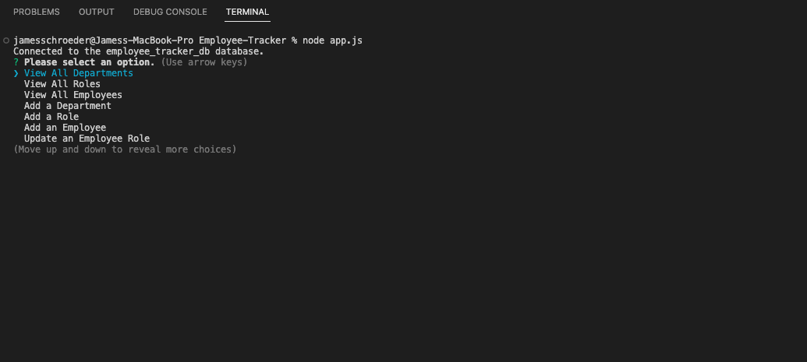
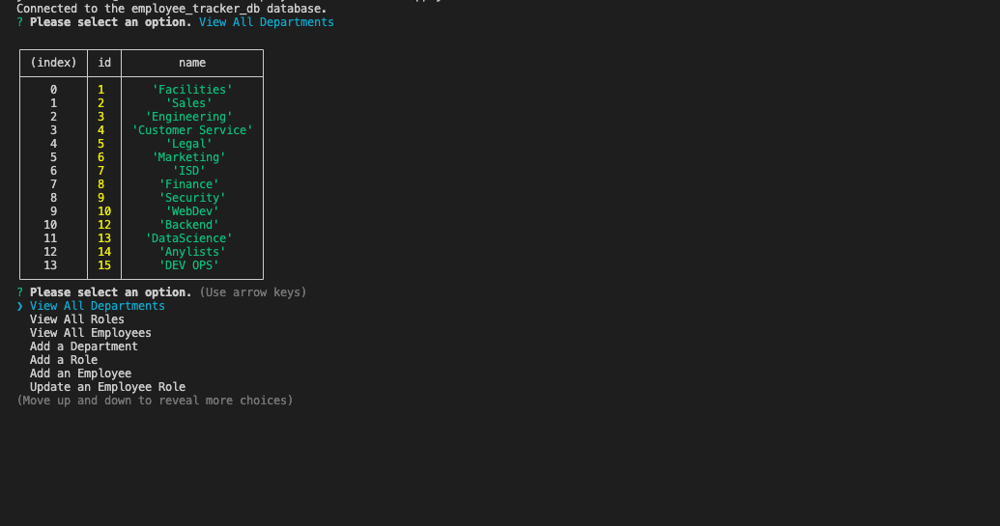
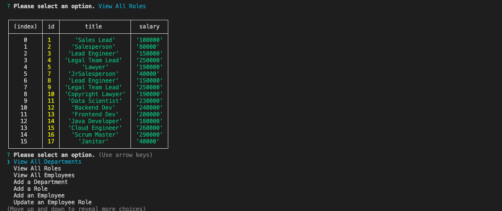
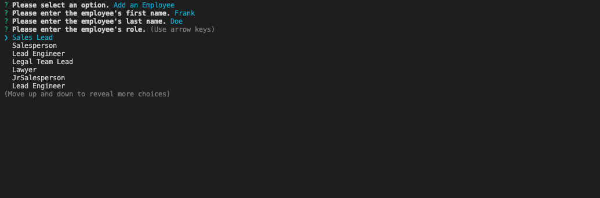

# Employee Manager

  

  ## Description:
        
  A CLI tool that allows you to view, create, and update a mysql2 database to manage your employees.
    
  ---

  ## Demo of Project:
  - Click [here](https://watch.screencastify.com/v/LDSsba9OWfHyeiVXPloK) to view demo
  
  ## Table of Contents:
    
  - [Instillation](#instillation)
  - [Usage](#usage)
  - [Credits](#credits)
  - [License](#license)
  - [Questions](#questions)
  
  ## Instillation:
  
  You can install this project by cloining down the code from github to a local file and linking it to a mysql2 database.
  
  ## Usage:
  
  This tool can be used to quickly view, create, and update values in an employment database. You are able to update employees' roles, create new employee entries,  create new departments ,and  create new roles to assign to employees.
  
  ## ScreenShots:

  ---

  

  ---

  

  ---

  

  ---

  

  ---

  ## Credits:
  Third-party Assets:
  - Inquirer
  - mysql2
  - DBeaver
  - Node.js

  
  ## License:
  
  This project uses the [MIT](https://opensource.org/licenses/MIT) license.

  ## Tests:

  ---
  
  ## Questions:

  Please feel free to get in contact if you have any questions about this project.

  - Github: [Jamesgit22](https://github.com/Jamesgit22)
  - Email: jamesschroedermail97@gmail.com